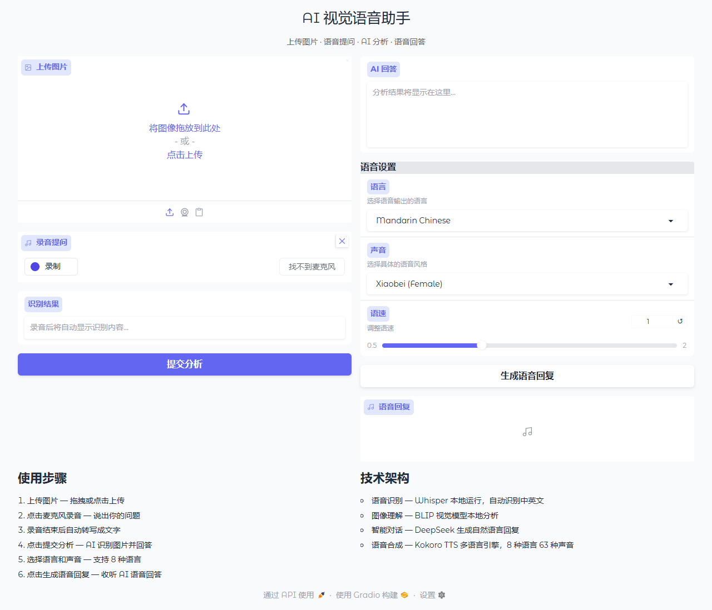

# Multimodal AI Visual Assistant

A full-stack multimodal AI assistant that enables users to interact with images using natural language and voice. Upload an image, ask a question by voice, and get a spoken answer — all in your preferred language.

## Features

- **Image Upload & Analysis**: Upload any image and ask questions about it by voice.
- **Voice Input & Transcription**: Record queries, transcribed in real-time with OpenAI Whisper.
- **Hybrid Vision Reasoning**: BLIP vision models extract image features locally, DeepSeek API crafts natural language responses. Falls back to Gemini or pure local BLIP.
- **Multilingual Voice Output**: Kokoro TTS generates speech in 8 languages with 63 voices.
- **Language-Aware Responses**: AI automatically responds in the same language as your question. TTS translates responses when voice language differs.
- **Voice Customization**: Select language, voice style, and speech rate.
- **Automated Asset Management**: All models and voices auto-download on first run.

## Screenshots



## Architecture

```
User
  │
  ▼
Gradio UI (app/frontend/gradio_app.py)
  │
  ▼
Flask API (app/backend/services/flask_app.py)
  │
  ▼
ModelManager (app/backend/utils/model_manager.py)
  ├─ Whisper (Speech-to-Text)
  ├─ BLIP + DeepSeek / Gemini (Image+Text Reasoning)
  └─ Kokoro TTS (Text-to-Speech)
```

- Flask backend runs as a daemon thread, Gradio UI in the main thread.
- Vision backend priority: DeepSeek+BLIP > Gemini > pure BLIP (configurable via `.env`).

## Supported Languages & Voices

| Language | Voices |
|----------|--------|
| American English | 11 female, 8 male |
| British English | 4 female, 4 male |
| Japanese | 4 female, 1 male |
| Mandarin Chinese | 4 female, 4 male |
| Spanish | 1 female, 2 male |
| French | 1 female |
| Hindi | 2 female, 2 male |
| Italian | 1 female, 1 male |
| Brazilian Portuguese | 1 female, 2 male |

See [`kokoro_voices.py`](app/backend/utils/kokoro_voices.py) for the full list.

## Installation

1. **Clone the repository:**
   ```bash
   git clone https://github.com/chonglangchen/multimodal-ai-assistant.git
   cd multimodal-ai-assistant
   ```

2. **Create and activate a virtual environment:**
   ```bash
   python -m venv .venv
   .venv\Scripts\activate     # Windows
   source .venv/bin/activate   # macOS / Linux
   ```

3. **Install dependencies:**
   ```bash
   pip install -r requirements.txt
   ```

4. **Configure environment variables:**
   ```bash
   cp .env.example .env
   ```
   Edit `.env` and set your `DEEPSEEK_API_KEY` (or `GOOGLE_API_KEY`). All configuration is read from `.env` only.

5. **Download BLIP models (one-time, ~800MB):**
   ```bash
   python download_blip_models.py
   ```

6. **Run the application:**
   ```bash
   python main.py
   ```
   Open [http://localhost:7860](http://localhost:7860) in your browser.

## Configuration

All settings in `.env`:

| Variable | Description | Default |
|----------|-------------|---------|
| `DEEPSEEK_API_KEY` | DeepSeek API key (enables hybrid vision mode) | — |
| `DEEPSEEK_BASE_URL` | Custom API base URL (e.g. SiliconFlow) | `https://api.deepseek.com` |
| `DEEPSEEK_MODEL` | Model name | `deepseek-chat` |
| `GOOGLE_API_KEY` | Gemini API key (fallback) | — |
| `FLASK_SECRET_KEY` | Flask session secret | — |
| `UPLOAD_FOLDER` | Upload directory | `app/uploads` |

## Project Structure

```
├── app/
│   ├── backend/
│   │   ├── services/           # Flask API endpoints
│   │   └── utils/              # ModelManager, voices, text utils
│   ├── frontend/               # Gradio UI
│   └── uploads/                # Temp files (auto-cleaned)
├── assets/                     # Screenshots
├── tests/                      # Pytest suite
├── main.py                     # Entry point
├── download_blip_models.py     # BLIP model downloader
├── download_unidic.py          # Japanese dictionary downloader
└── requirements.txt
```

## Testing

```bash
pytest
```

Tests cover API endpoints, model logic, and UI workflow with mocked ML dependencies.

## License

MIT License. See [LICENSE](LICENSE) for details.

## Acknowledgments

- [OpenAI Whisper](https://huggingface.co/openai/whisper-tiny)
- [DeepSeek](https://platform.deepseek.com)
- [BLIP](https://huggingface.co/Salesforce/blip-vqa-base)
- [Kokoro TTS](https://github.com/hexgrad/Kokoro)
- [Gradio](https://gradio.app)
- [Flask](https://flask.palletsprojects.com)
